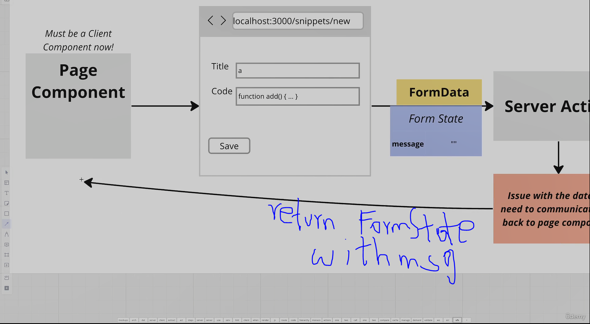

# Server Forms with the useFormState hook

- Form validation is very simple if it is done on the client like in react.

## Error handling with server actions
- However, server forms can work without JS in the browser.
- That's why error handling is more complicated.

Since forms in our pages are sending some info to a server action, we need to communicate info from a server action, if an error occurs, back to the page.

This can be done with a hook buil-into React-dom called 'useFormState'.


```tsx
//in actions.ts
export async function createSnippet(formState: {message:string}, formData:FormData){
  return {
    message: 'Title must be longer',
  }
}

//in client page
import {useFormState} from 'react-dom';
import * as actions from '@/actions';

export default function SnippetCreatePage(){
  const [formState, action] = useFormState(actions.createSnippet, {message: ''});

  return (<form action={action}>
    <div>{formState.message}</div>
  )
}
```

## Handling unexpected errors with messages that users probably wouldn't understand
- We can create a custom error message or file with `error.tsx`.
- This must be a client component.

```tsx
'use client'

interface ErrorPageProps{
  error: Error,
  reset: () => void;
}

export default function ErrorPage({error}: ErrorPageProps){

}
```

- The `reset` prop is typically used to handle refresh a route when user clicks a button or something.
- The problem with this way is that user goes to another page and doesn't have the ability to, lets say, submit a form again.
- Better to use try-catch blocks where errors are likely to occur, like in forms.

```ts
//in actions.ts
export async function createSnippet(
  formState: { message: string },
  formData: FormData
) {
  try {
    // Check the user's inputs and make sure they're valid
    const title = formData.get('title');
    const code = formData.get('code');

    if (typeof title !== 'string' || title.length < 3) {
      return {
        message: 'Title must be longer',
      };
    }
    if (typeof code !== 'string' || code.length < 10) {
      return {
        message: 'Code must be longer',
      };
    }

    // Create a new record in the database
    await db.snippet.create({
      data: {
        title,
        code,
      },
    });
  } catch (err: unknown) {
    if (err instanceof Error) {
      return {
        message: err.message,
      };
    } else {
      return {
        message: 'Something went wrong...',
      };
    }
  }

  // Redirect the user back to the root route
  redirect('/');
}
```
