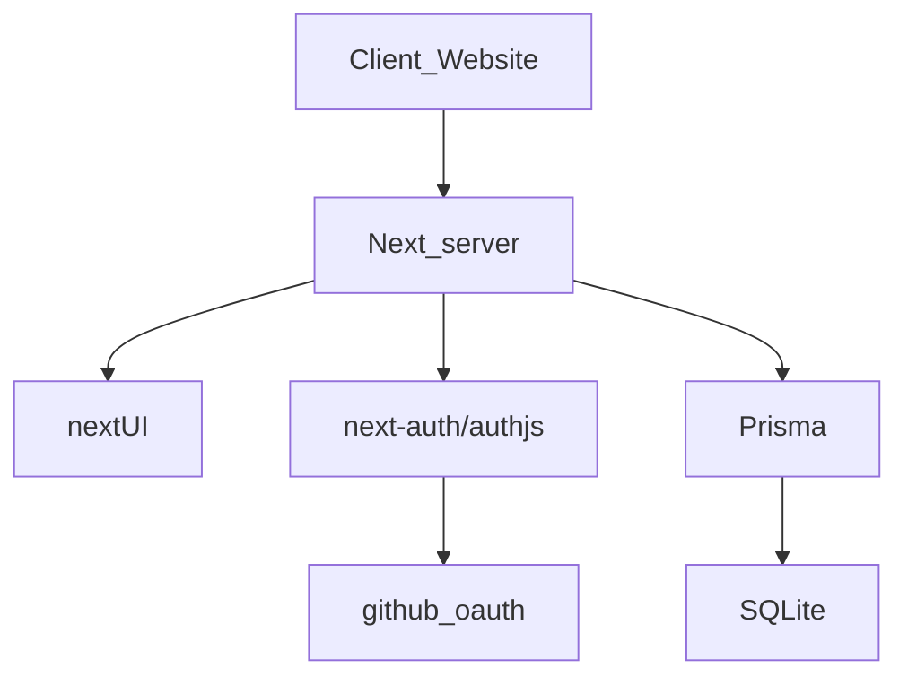

# NextAuth (using social media project)

```mermaid
graph TD;
    Client_Website --> Next_server;
    Next_server --> nextUI;
    Next_server --> next-auth/authjs;
    next-auth/authjs --> github_oauth;
    Next_server --> Prisma;
    Prisma --> SQLite;
```

**Libraries used:**
- NextUI (Component Library)
- next-auth/authjs (authentication)
- Prisma (database)
