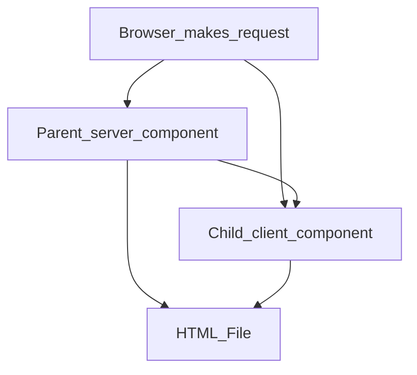
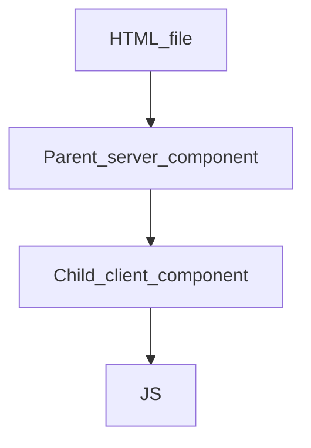

Define a server action. This is a function that will be called when the form is submitted.

# Server Actions
- Whenever you need to **change data** in a Next app, you should be thinking of server actions.
- It's highly compatible with HTMl forms.
- Server actions are functions that will be called with the values a user entered into a form.

# Types of Components in NextJS
| Server Components | Client Components |
|--------|--------|
Changes the rules of client components a little bit | Its the same as React Components|
|Typically preferable for performance and UX because deeply integrated in NextJS| Only used where necessary|
|NextJS uses server compoonents by default| React uses client components by default|
| Can use async await without useState, useEffect | Need useState, useEffect|
**Disadvantages:**
| Can not use any kind of hook | Can use hooks
| Can not assign any event handlers | Can use event handlers

- In NextJS, you can create a client component by putting `use client` ant the top of the code.
- You cannot import a server component in a client component and  show it as a child.

## How Browser makes request to NextJS
First request renders an html file to the browser.


Second request gets the JS from client components only.


- Note that despite the name, client components get executed once on the server when the browser makes a request.

## Creating a Snippet with Server actions and Prisma
```tsx
import {db} from '@/db';
import {redirect} from 'next/navigation';
export default function SnippetCreatePage(){
  async function createSnippet(formData: FormData){
    //This needs to be a server action
    'use server';
  //Check user's inputs and make sure they are valid
  const title = formData.get('title') as string;
  const code = formData.get('code') as string;
  //Create a new record in the database
  const snippet = await db.snippet.create({
    data:{
      title,
      code
    }
  });
  console.log(snippet);
  //Redirect the user to a page, like root page.
  redirect('/');
  }
  return <Form action={createSnippet}>//Rest of the code</Form>
}
```

- By default, Typescript assumes that all inputs coming out of a form could be a file or a string. So, to specify that the input is indeed a string, we are using the `as string`.

## React VS Next: Where is the code running?
| React | NextJS |
|------|--------|
| All JS code runs on the browser | Some JS code runs in browser and some runs on the server.
| To change data, request is sent to an outside server | To change data, request is sent from Next server action

## Fetching data from Server
1. Create a server component.
2. Mark the component as async.
3. Make an HTTP request or directly access the db to get your data.
4. Render your data directly or pass it to a child component.

```tsx
const snippets = await db.snippet.findMany();

  const renderedSnippets = snippets.map((snippet) => {
    return (
      <div key={snippet.id}>
        {snippet.title}
      </div>
    );
  })
```

## Creating Dynamic Paths to render something different from info
For `snippets/new/1` where 1 is going to change, we can create a folder called `[id]` in new.

```tsx
import { db } from '@/db';
import { notFound } from 'next/navigation';

interface SnippetShowPageProps {
  params: {
    id: string
  }
}

export default async function SnippetShowPage(props: SnippetShowPageProps) {
  const snippet = await db.snippet.findFirst({
    where: { id: parseInt(props.params.id) }
  });

  if (!snippet) {
    return notFound();
  }
```

## Not Found Page
NextJS provides a default Not found page to show if a page is not found.

You can customize it by creating a `not-found.tsx` file in the same directory as page.tsx.

You can put multiple not-found pages for different routes. NextJS looks for the closest not-found page and displays it.

## Automatic loading spinner - loading.tsx
Works same way as not found and error page. Can be different for different routes or same.

Since its hard to simulate this loading if the data is fetched from local db, you can set artifical delay.

Add this before the data fetching:
```tsx
await new Promise((r) => setTimeout(r, 2000));
```

**Note:** You can also just return a `<div> Sorry page not found</div>` instead of creating a not-found page also. Depends on preference and usability.
